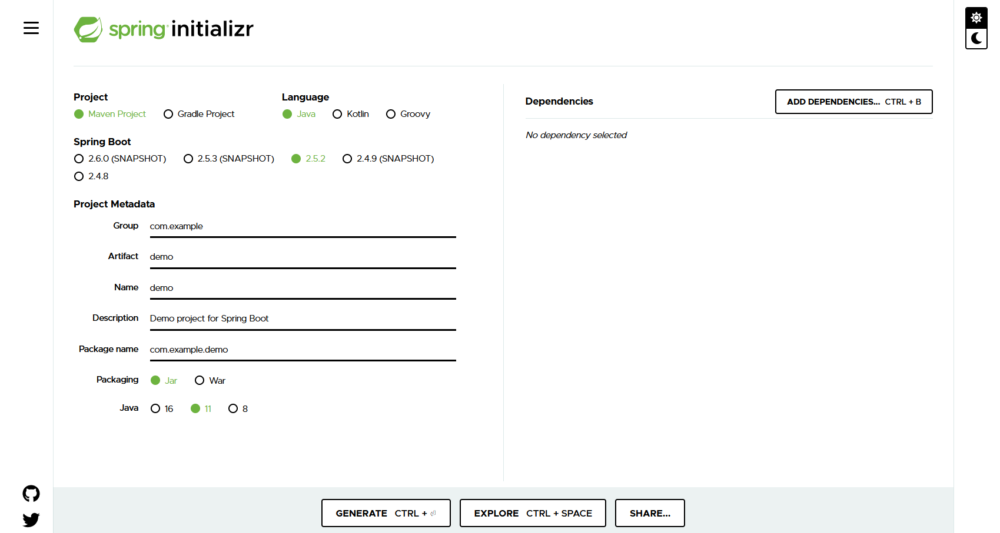

# Spring Boot Reference Material
Review guide for developing with Spring Boot Framework

## Table of Contents
- [What is Spring Boot?](#what-is-spring-boot)
- [Features of Spring Boot](#features-of-spring-boot)
- [Why Spring Boot?](#why-spring-boot)
- [Spring vs. Spring Boot](#spring-vs-spring-boot)

### What is Spring Boot?
- Spring Boot is a Spring module to simplify the use of Spring Framework for Java Development.
- Spring Boot allows you to make standalone Spring Boot applications which can just be run.
- Removes many configurations and dependencies to assist in rapid development.
- Spring Boot comes with embedded servers, auto-configurations, and Spring Boot CLI.
- "Takes an opinionated view of the Spring Platform".

### Features of Spring Boot
- Spring Boot CLI
- Spring Initializr
- Spring Actuator
- Starter Dependency
- Autoconfiguration
- Logging and Security

### Why Spring Boot?
- Stability
- Based on JVM
- Connectivity
- Cloud Native
- Flexibility
- Open Sourced

### Spring vs. Spring Boot
- Spring applications take time to get up and running whereas Spring Boot applications have much faster startup times.
- Spring "manages lifecycle of Java" while Spring Boot doesn't need to have a configured data source.
  - Spring Boot's auto-configuration measures are the reason why!
- Spring has a "dependency injection framework" but Spring Boot has pre-configured technology and frameworks.
- Spring Boot allows us to create a web application which can simply be run or executed. It is less complex than Spring. 

### Installation and Setup
- Can be done with either your IDE, if it has a plugin for creating a Spring Boot project, or the [Spring Initializr](https://start.spring.io/).
  - Your machine will need to meet the system requirements for the technologies selected in the Initializr.

- Once you have selected your preferences, you have the option to add dependencies based on what your project will require. Don't worry, if you decide you need a dependency later on in the process you can add it easily later!
- The Initializr will allow the user to download a complete generated Spring Boot project matching their preferences. Open this in an IDE and you are ready to begin Spring Boot development.
- Another option is to generate a Spring Boot project from your IDE. This varies from IDE to IDE and will require you to do some independent research.

